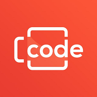

# bc-live-repository
# Beer and Code Petiscando #XX|LIVE CODING|Sextou
<div align="center">
	
</div>

## O tema da mesa do bar é...  Laravel com Taylor Otwell.

<br/>

Quer saber mais sobre como essas features fazem a diferença em nossos projetos? Tem alguma dúvida ou dificuldade?

Petiscando #001​ - Porque confiar no PHP? https://www.youtube.com/watch?v=7Va0x...​

✅ FAÇA PARTE DA NOSSA COMUNIDADE NO TELEGRAM: https://bit.ly/BeerandCodeTelegram​

✅ ENTRE NO NOSSO DISCORD: https://bit.ly/2ZMJTvS​

#petiscando​ #beerandcode​
=================
🍻 Se gostou e foi útil pra você, acesse o vídeo em nosso canal, deixe um like e compartilhe 🍻
🍻 Se inscreva no canal 🍻
🍻 Ativa o sininho pra receber notificação sempre que tiver vídeo novo 🍻

<p>
Redes Sociais:
<br/><br/>
✔ Discord: https://discord.com/invite/mhyKFgv
<br/>
✔ Twitter: https://twitter.com/beerandcodeyt/
<br/>
✔ Instagram: https://www.instagram.com/beerandcode_oficial
<br/>
✔ Facebook: https://www.facebook.com/beerandcodeoficial/
<br/>
✔ Spotify: https://open.spotify.com/show/5xGXrAp97Ff9TZYgTYvdhL?si=TimdoZoOQvqzX7FeWHlT-A&nd=1
​<br/>
✔ Site: https://beerandcode.com.br/ 
<br/>
✔ Linktree: https://linktr.ee/beerandcode​
<br/>
</p>
Contato:
✉ contato@beerandcode.com.br

=================

Seja muito bem-vindo(a) ao canal Beer and Code!!

Em nosso canal do YouTube você encontra vídeos toda semana, apresentados por Danilo Sampaio e Icaro Jobs.

O canal tem como objetivo ensinar de maneira simples e direta o framework Laravel, a linguagem PHP e todo o ecossistema que os cerca. Queremos compartilhar anos de experiência de mercado para que as pessoas consigam criar projetos incríveis usando essas tecnologias que a cada ano crescem ainda mais no mundo todo.

## Instalação

Clone o projeto:

```
git clone «URL DO REPOSITÓRIO»
```

Uma vez clonado, abra na pasta do projeto:

```
cd «DIR DO PROJETO»
```

Dentro da pasta do projeto, copie o arquivo *.env.example* para *.env*.
Agora, modifique o .env insirindo insira as credenciais do seu banco de dados.

```
DB_CONNECTION=mysql
DB_HOST=«ENDEREÇO DO SEU BANCO DE DADOS»
DB_PORT=3306
DB_DATABASE=«NOME DO SEU BANCO DE DADOS»
DB_USERNAME=«USUÁRIO DO SEU BANCO DE DADOS»
DB_PASSWORD=«SENHA PARA O USUÁRIO»
```

Por exemplo:
```
DB_CONNECTION=mysql
DB_HOST=127.0.0.1
DB_PORT=3306
DB_DATABASE=beerandcode
DB_USERNAME=dba
DB_PASSWORD=senha1234
```

Agora, instale o projeto:

```
composer install
php artisan key:generate
php artisan migrate
php artisan serve
```


# Observações importantes:
* Esse repositório foi criado exclusivamente para fins didáticos, para facilitar a compreensão do que abordamos em nossa live.  Não oferecemos nenhuma garantia sobre ele.* Se descobriu alguma inconsistência ou deseja contribuir com seu conhecimento, ótimo!  Você já deve saber o que fazer: fork, code, commit, push, PR...
* O nosso trabalho é voluntário.  Somos apaixonados por tecnologia, PHP, Laravel (E cerveja! 🍻🍻🍻). Por isso não podemos oferecer suporte sobre o conteúdo deste repositório. Contamos com a sua curiosidade para desbravar o seu conteúdo da mesma maneira que nós fazemos: estudando a documentação disponível, recorrendo ao Google, Discord, grupos no Telegram e WhatsApp.
